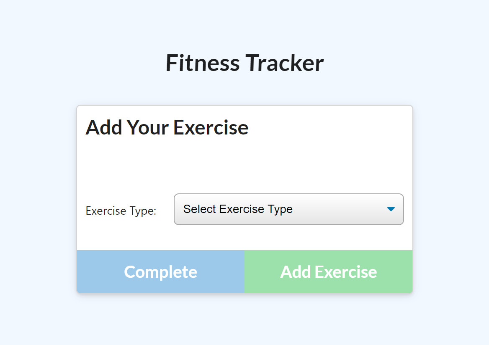

  # workout-tracker
  Create, view and track daily workouts using this application.
  
  
  
  ## Table of Contents
  1. [Site](#Site)
  2. [Usage](#Usage)
  3. [License](#License)
  4. [Questions](#Questions)
  
  ## Site
  [Check it out here!](https://fitness-tracked.herokuapp.com/ "workout tracker")
  
  ## Usage
  
  
  Add workouts or continue a previous workout from the main page displayed above. Click on the blue button to continue a current workokut. Click on the red button to start a new workout. 
  
  
  
  You will be brought to this page where you can add an excise. Select from the two options labeled 'Resistance' or 'Cardio'. Complete the form by clicking the green 'Add exercise'. Your exercise will be added to the database. Once you have finished adding exercises, you may exit by clicking the blue 'Complete' button.  
  
  ## License
  This project operates under the MIT license
  
  
   
  ## Questions
  
  GITHUB: https://github.com/angeleefshaw
  ---
  EMAIL: angeleefshaw@gmail.com
  ---
  LINKEDIN: https://www.linkedin.com/in/angelee-shaw-2a65861bb/
  ---
  
